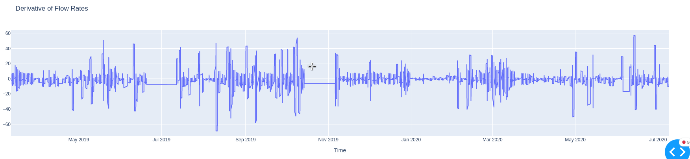

# Lessons Learned
## Lecture 1: 
 
Pay attention to the documentation: 
Documentation is time intensive and cumbersome to keep it up to date! 

 

## Lecture 2: 

Version control of packages. -> Look at the Problems of the project, try to minimize them to a minimum
NEVER TRUST YOUR DATA, be aware what you have, resp. what you're doing, always verify your intentions!

## Lecture 3:

Someone will sooner or later **touch your code**. Let's code it the way so it is reusable, forget about the quick & dirty coding!
Clarify your goal iterative with the costumer. This way we can assure that everyone is happy with the end product.

## Lecture 4:

pip install -e . # editable python packages
Be aware of what is counted as an outlier. Outlier detection has to be done very precisely because we won't delete 
datapoints that might be of value.

## Final report:
### What's so special about saturdays?

As it looks saturdays are in nearly all of the sensorstations at a low level.
This could be a indication for a possible minimum. 
Further it appears to be also a weekly pattern, sadly i wasn't capable of implementing a plot that overlay's the night data on the x-axis to verify it.

### What is special about 1st of January?

In my filtered nighttime data the January 2020 is present where an abrupt change can be observed in the derivative of the flow rate, particulary in the luppmenweg.
A possible explanation could be that there is minimal industrial activity during january, there are two big industrial companies located
   - 1. electro suisse
   - 2. Aptomet AG

It seems this could be a good starting point for the specific pipe as a minimum value.

## Conclusion

From my perspective all the pipes look currently alright, but there is two candidates which might have
a leakage or will be infiltrated by groundwater in the future.
My conclusion is mainly drawn from eyeballing the ts and isn't scientifically backed.
- 1. Bahnhofstrasse_y
- 2. Bahnhofstrasse_x

As they both have a really weak signal and no steady low periods.

To draw a more reliable conclusion i would consider to look at more data than just 2019 and 2020.

# Week 6
Maintenance based on the bath-tub curve:

high failure rate (commissioning errors) - low failure rate - increasing failure rate (wear out)

Condition based maintenance is part of preventive maintenance which tries to prevent failures and is scheduled, continuous or on request

Be aware of what you want to achieve with a model, and keep it as simple and fast as possible.